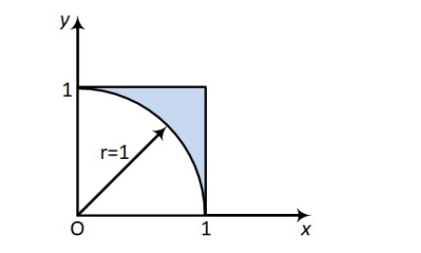
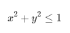
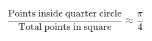
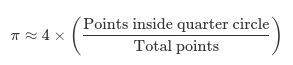

### What is the Monte Carlo Simulation?

Monte Carlo Simulation is a way to estimate the answer to a complex problem by using random numbers and repeating an experiment many times. For example, let's say we want to calculate the area of a circle, but we don't know the formula A=πr².

Instead, we draw a rectangle that completely contains the circle. Since we know how to calculate the area of a rectangle (length × width), we generate random points inside the rectangle. Some of those points will fall inside the circle, and some will fall outside. We use the ratio of points that fall inside the circle vs points that fall outside the circle and multiply it by the area of the rectangle. We know that a point has landed inside the circle using the formula: x² + y² ≤ 1. The more points we generate, the better our estimate becomes.

```
Points inside circle / Total points × Area of rectangle ≈ Area of the circle
```

#### Estimating Pi with Monte Carlo


##### Unit Square
A square with side length 1, giving an area of 1.



##### Quarter Circle
A quarter of a unit circle (radius = 1) is inscribed within the square.
- Full circle area: π × r² = π × 1² = π
- Quarter circle area: π/4

##### Random Sampling
Random points are generated within the unit square. Each point has an x and y coordinate between 0 and 1.

A point (x, y) falls inside the quarter circle if:



This condition comes from the equation of a circle centered at the origin with radius 1.

Because the quarter circle is fully contained within the square, the ratio of points that fall inside the circle to the total number of points approximates the ratio of their areas:



Solving for π gives the estimation formula:



The accuracy of the estimate improves as the number of sampled points increases.

The code for this is provided in the root directory and can be ran with `g++ estimating_pi.cpp`; `./a.out`.